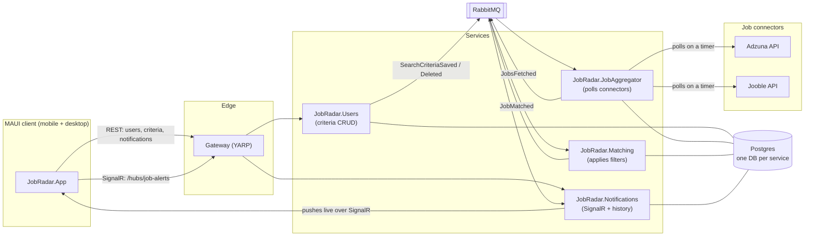

# JobRadar architecture

## Why it's shaped this way

**Gateway (YARP)** is the one address the client ever talks to. It fans REST calls out to
Users and Notifications, and proxies the SignalR WebSocket connection through to
Notifications too. JobAggregator and Matching have no public HTTP surface at all — they're
pure event consumers/producers and don't need one, which is itself worth pointing out in an
interview: not every microservice needs to be reachable from the outside.

**Event-carried state, not service-to-service calls.** When JobAggregator needs to know what
to search for, it doesn't call Users' API — it keeps its own local copy of "active watches"
built entirely from consuming `SearchCriteriaSaved`/`SearchCriteriaDeleted` events published by
Users. Same idea downstream: `JobsFetched` carries the full `SearchCriteria` (keywords,
location, filters) alongside the fetched postings, so Matching never has to call back out to
find out what a user actually wanted. This is the classic event-driven microservices tradeoff —
more moving parts than a shared database, but each service can keep running (and be scaled,
redeployed, or taken down) independently of the others.

**Database per service.** Users, JobAggregator, Matching, and Notifications each get their own
Postgres database (`usersdb`, `aggregatordb`, `matchingdb`, `notificationsdb`) on the same
Postgres *instance* — a pragmatic simplification for local/dev; a real deployment would likely
give each its own instance too, but the schemas are already fully separated, which is the part
that actually matters for service autonomy.

**Pluggable connectors.** `IJobConnector` is the entire contract a new job source has to
implement (`Name`, `IsConfigured`, `SearchAsync`). `PollActiveWatchesJob` just iterates whatever
connectors are registered in `JobRadar.JobAggregator/Program.cs` — adding a third source (say,
USAJobs or a specific company's Greenhouse board) means writing one new connector class and
adding one line to `Program.cs`, nothing else in the pipeline changes.

## Request/event flow, start to finish

1. User opens the app, "logs in" with just an email (`POST /api/users` via Users service).
2. User saves a search (keywords, location, optional min salary / remote-only) —
   `POST /api/criteria`. Users persists it and publishes `SearchCriteriaSaved`.
3. JobAggregator consumes that event and upserts its own local `ActiveWatch` row.
4. Every `Aggregator:PollIntervalMinutes` (default 10), a Quartz.NET job re-runs every active
   watch's query against Adzuna (and Jooble, if configured), normalizes results into the shared
   `JobPosting` shape, and publishes one `JobsFetched` event per watch.
5. Matching consumes `JobsFetched`, applies the filters the connector query itself couldn't
   (min salary, remote-only, job type, excluded keywords), skips anything already seen for that
   user (its own `SeenJobs` table), and publishes `JobMatched` for anything new.
6. Notifications consumes `JobMatched`, stores a row (so `GET /api/notifications` always has
   history even if the app was closed), and pushes it live over SignalR to that user's group —
   the client updates instantly if it's open, no refresh needed.

## Known simplifications (called out on purpose, not missed)

- **Auth is a stand-in.** `X-User-Id` header, no password, no token. Swap for ASP.NET Core
  Identity + JWT (and authenticate the SignalR hub connection) before this is anything but a
  portfolio/demo project.
- **`EnsureCreated()`, not EF migrations.** Keeps `docker compose up` a true one-command
  clone-and-run with no migration step. A production service would use
  `dotnet ef migrations add` / `Database.Migrate()` instead so schema changes are versioned.
- **No connector query de-duplication.** If two users save the identical keywords/location,
  JobAggregator queries the connectors twice instead of once. Fine at demo scale; a natural
  v2 optimization if this ever needed to control API call volume.
- **Jooble has no structured salary field**, so `MinSalary`-filtered searches only really bite
  on Adzuna results until that's improved (parsing the free-text salary string, most likely).
