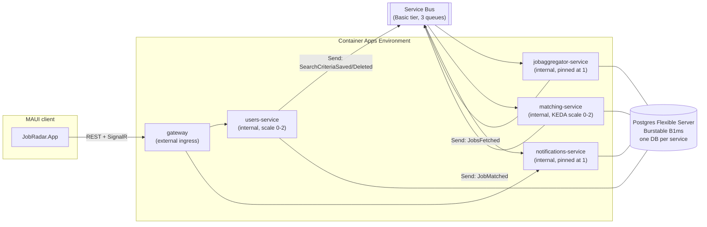

# Hosting JobRadar on Azure

`deploy/azure/main.bicep` deploys the whole backend to Azure Container Apps at close to the
lowest cost that still keeps every feature working - real-time SignalR push included. This is
the cloud counterpart to `docker-compose.yml`, not a replacement for it: local development still
runs Postgres and RabbitMQ in containers exactly as before (see
[architecture.md](architecture.md)).



## Components, and why each one was picked

| Component | Choice | Why |
|---|---|---|
| Compute | **Azure Container Apps**, Consumption plan | Scale-to-zero for the stateless HTTP services, KEDA-based scaling for the queue consumer, and a generous included monthly grant of vCPU/memory-seconds - the cheapest way to run 5 always-deployed services without a fixed per-service base cost. |
| Messaging | **Azure Service Bus, Basic tier** | No monthly minimum (~$0.05/million operations) - but Basic tier has no topics/subscriptions, only queues. See [Why Send instead of Publish](#why-send-instead-of-publish) below for what that costs in code. |
| Database | **Postgres Flexible Server, Burstable B1ms** | Cheapest *managed* Postgres tier (~$12-15/month). Self-hosting Postgres in a Container App instead saves little to nothing once you price its always-on vCPU/memory-seconds, and you'd lose backups and restore points for the trouble. |
| Container registry | **GitHub Container Registry (ghcr.io), public packages** | Azure Container Registry's cheapest tier (Basic) still runs ~$5/month. GHCR is free for public images, which is a reasonable tradeoff for a portfolio project with no proprietary code. |
| Logging | Log Analytics workspace (pay-as-you-go, `PerGB2018`) | Required by Container Apps for `az containerapp logs` / diagnostics; cost scales with log volume, which is negligible at demo traffic. |

Rough total: **~$15-20/month**, almost entirely the Postgres line item.

## Why Send instead of Publish

Every event in this app has exactly one consumer (`SearchCriteriaSaved`/`Deleted` →
JobAggregator, `JobsFetched` → Matching, `JobMatched` → Notifications - see
[architecture.md](architecture.md)). MassTransit's default `Publish()` call routes through a
topic-and-subscription model (an exchange in RabbitMQ, a Topic + Subscription in Service Bus),
which needs the Standard tier (~$10/month minimum) on Azure. Since nothing here is genuinely
fan-out, the publishing call sites (`CriteriaController`, `JobsFetchedConsumer`,
`PollActiveWatchesJob`) send directly to the consumer's queue instead, via
`ISendEndpointProvider.Send(...)` plus a static `EndpointConvention.Map<TEvent>(new
Uri("queue:..."))` registered once at startup in the publishing service's `Program.cs`. This
works identically against RabbitMQ locally and Service Bus in the cloud - only the transport
configuration differs, not the call sites.

## Local vs. cloud transport switch

Each service reads `Messaging:Transport` from configuration (`RabbitMq` by default,
`AzureServiceBus` to switch):

- **Local (`docker-compose.yml`)**: `Messaging__Transport=RabbitMq` is set explicitly on all four
  messaging services; `RabbitMq:Host/User/Password` point at the `rabbitmq` container.
- **Azure (`main.bicep`)**: each Container App sets `Messaging__Transport=AzureServiceBus` and
  `AzureServiceBus__ConnectionString` to the deployed namespace's connection string.

No code change is needed to move between them - see `Program.cs` in any of the four services
(`JobRadar.Users`, `JobRadar.JobAggregator`, `JobRadar.Matching`, `JobRadar.Notifications`) for
the branch.

## Why replica counts differ per service

- **gateway, users-service**: plain HTTP, no in-process state → `minReplicas: 0`. Scales to zero
  when idle, cold-starts on the next request.
- **matching-service**: pure Service Bus consumer, no inbound HTTP traffic → `minReplicas: 0`
  with a KEDA `azure-servicebus` scale rule that wakes it when a message lands on
  `matching-jobsfetched`.
- **jobaggregator-service**: pinned at exactly **1** replica. Its poll loop is an in-process
  Quartz.NET timer, not something an external trigger can wake - scaling to zero would stop
  polling entirely, and scaling *out* would poll (and publish) every active watch multiple times
  over.
- **notifications-service**: pinned at exactly **1** replica. The MAUI client's SignalR
  connections live in memory on whichever instance accepted them, and there's no backplane
  (Azure SignalR Service or Redis) to fan a push out across replicas. Scaling this past 1 without
  adding a backplane would silently drop notifications for users connected to a different
  replica than the one that got the event.

## Deploying

Prerequisites: Azure CLI (`az login` first), Docker, and a GitHub account for `ghcr.io` (or swap
`CONTAINER_REGISTRY` for your own registry). Fill in `RESOURCE_GROUP`, `CONTAINER_REGISTRY`,
`POSTGRES_ADMIN_PASSWORD`, etc. in `.env` first (see `.env.example`) - both scripts below load it
automatically, the same way `docker compose up` does.

**PowerShell:**

```powershell
docker login ghcr.io -u yourusername
.\deploy\azure\deploy.ps1
```

**Bash:**

```bash
echo "$GITHUB_TOKEN" | docker login ghcr.io -u yourusername --password-stdin
./deploy/azure/deploy.sh
```

Either script builds and pushes all 5 images, then deploys `main.bicep` (via `main.bicepparam`)
and prints the outputs, including `gatewayUrl` - the address the client should call. Point the
MAUI client at it by setting `RemoteBaseUrl` in
[`src/Client/JobRadar.App/Services/GatewayConfig.cs`](../src/Client/JobRadar.App/Services/GatewayConfig.cs)
to that URL.

### Why there's no committed parameters file

`main.bicepparam` is Bicep's native parameters format, and every value in it comes from
`readEnvironmentVariable('SOME_VAR', 'optional default')` rather than a literal - so the file
itself never contains a secret and is safe to commit. `deploy.ps1`/`deploy.sh` load `.env` into
the process environment before calling `az`, which is what actually supplies the values at
deploy time. (An earlier version of this setup used a plain JSON parameters file, which meant
real values had to either be hand-edited in on every deploy or committed outright - `.bicepparam`
avoids both.)

To preview a deployment without applying it (`--what-if`), load `.env` into the current session
first since `az` won't do it for you:

**PowerShell:**

```powershell
Get-Content .env | Where-Object { $_ -and -not $_.StartsWith('#') } | ForEach-Object {
    $name, $value = $_.Split('=', 2)
    [System.Environment]::SetEnvironmentVariable($name, $value)
}
az group create --name $env:RESOURCE_GROUP --location $env:LOCATION --output none
az deployment group create --what-if `
    --resource-group $env:RESOURCE_GROUP `
    --template-file deploy/azure/main.bicep `
    --parameters deploy/azure/main.bicepparam
```

**Bash:**

```bash
set -a && source .env && set +a
az group create --name "$RESOURCE_GROUP" --location "$LOCATION" --output none
az deployment group create --what-if \
  --resource-group "$RESOURCE_GROUP" \
  --template-file deploy/azure/main.bicep \
  --parameters deploy/azure/main.bicepparam
```

> **Region note**: `eastus` is commonly restricted for new Postgres Flexible Server
> provisioning on trial/free subscriptions (`az postgres flexible-server list-skus --location
> eastus` will show `"reason": "Provisioning is restricted in this region"` and empty
> `supportedServerVersions` if so). `eastus2`, `centralus`, and `westus2` are good
> alternatives - check with the same command before picking one.

## Pausing and resuming to save cost between test sessions

Container Apps with `minReplicas: 0` (gateway, users-service, matching-service) already scale
down on their own after idle time, but `jobaggregator-service` and `notifications-service` are
pinned at 1 replica always-on (see [Why replica counts differ per
service](#why-replica-counts-differ-per-service)), and Postgres Flexible Server bills for compute
time regardless of Container Apps activity. `stop.ps1`/`stop.sh` explicitly scale all 5 apps to
zero and stop the Postgres server; `start.ps1`/`start.sh` reverse both. Nothing is deleted -
Service Bus and Log Analytics have no idle cost, so they're left alone.

```powershell
.\deploy\azure\stop.ps1   # done testing for now
.\deploy\azure\start.ps1  # back to testing
```

Azure automatically restarts a stopped Postgres server after 7 days regardless of whether you've
run `start.ps1` - if you're pausing longer than that, just re-run `stop.ps1` afterward.

## Known simplifications (called out on purpose, not missed)

- **Postgres is publicly reachable** (restricted to "Azure services" via the special
  `0.0.0.0-0.0.0.0` firewall rule), not VNet-integrated. Simpler to deploy, but real production
  use should put both the Container Apps environment and Postgres in a VNet with private access.
- **No registry authentication configured** on the Container Apps - this assumes public GHCR
  packages. A private registry needs a `registries` block with a pull secret added to each app.
- **One Postgres instance, one admin login**, shared by all four databases - matches the same
  "database per service, one instance for now" simplification `docker-compose.yml` already makes
  locally (see [architecture.md](architecture.md)).
- **No CI/CD.** `deploy.sh` is a manual, idempotent `az deployment group create` - wiring it into
  a GitHub Actions workflow (build → push to GHCR → `az deployment group create`) is the natural
  next step if this becomes more than a portfolio deploy.
